---

## Developer

| Name | Role | Social |
|:----:|:----:|:------:|
İbrahim DOĞAN|Solo Developer & Product Owner|[](https://www.linkedin.com/in/dogan-ibrahim/) [](https://github.com/doganibrahim) [](mailto:ibrahimdogan.js@gmail.com)

---

<details>
  <summary><h2>Product Description</h2></summary>

Glonie is an EdTech SaaS application for language acquisition, strictly based on the **natural approach**. The app does not teach grammar rules and never uses native language translations. Learning happens through contextual visual cues, audio, and target language text paired with IPA (International Phonetic Alphabet) transcriptions.

To avoid cognitive overload, Glonie uses a *micro-learning* UX philosophy. A single traditional book chapter is broken down into 3-4 **bite-sized lessons**. The UI is a flashcard system where users process one sentence/interaction at a time.

The architecture follows a local-first hybrid approach, majority of the app runs on a static SQLite database to minimize API costs and maximize speed.


</details>

---

<details>
  <summary><h2>Setup Instructions</h2></summary>

### Prerequisites
- Node.js 18+
- Python 3.10+

### 1. Clone & Install

```bash
git clone <repo-url>
cd glonie

# Frontend dependencies
npm install

# Backend dependencies (use a virtual environment)
python -m venv .venv
.venv\Scripts\activate   # Windows
# source .venv/bin/activate  # macOS/Linux
pip install fastapi uvicorn sqlalchemy pyttsx3
```

### 2. Environment Variables

```bash
# Copy the example env file and edit as needed
cp .env.example .env
```

| Variable | Description | Default |
|----------|-------------|---------|
| `VITE_API_BASE_URL` | Backend API URL used by the frontend | `http://localhost:8000` |

### 3. Seed the Database

```bash
cd backend
python seed.py
```

### 4. Generate Audio Files (optional, for new lessons)

```bash
cd backend/assets
python create_audio_chapters_2_3.py
```

### 5. Run

```bash
# Terminal 1 - Backend
cd backend
uvicorn main:app --reload

# Terminal 2 - Frontend
npm run dev
```

Open `http://localhost:5173` in your browser.

</details>

---

<details>
  <summary><h2>Tech Stack</h2></summary>

| Layer | Technology | Role |
|-------|-----------|------|
| Frontend | React 19 + Vite 8 | SPA with component-based UI |
| Styling | Tailwind CSS 3.4 | Utility-first CSS framework |
| State Management | React useState/useEffect | Local component state |
| Backend | FastAPI 0.121 | RESTful API server |
| ORM | SQLAlchemy | Database abstraction layer |
| Database | SQLite | Local-first, zero-config persistence |
| Static Assets | FastAPI StaticFiles | Serves images and audio from `/assets/` |
| Localization | Custom JSON + useLocale hook | `en.json` → `t('key')` pattern |
| Audio | pyttsx3 (TTS generation) | Generated audio files for cards |

</details>

---

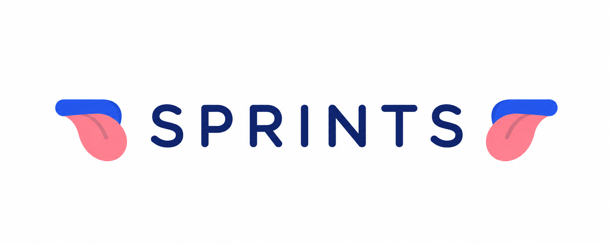

---

<details>
  <summary><h1>Sprint 1</h1></summary>

---

<details>
  <summary><h2>App Screenshots</h2></summary>

### Lesson Selection Screen

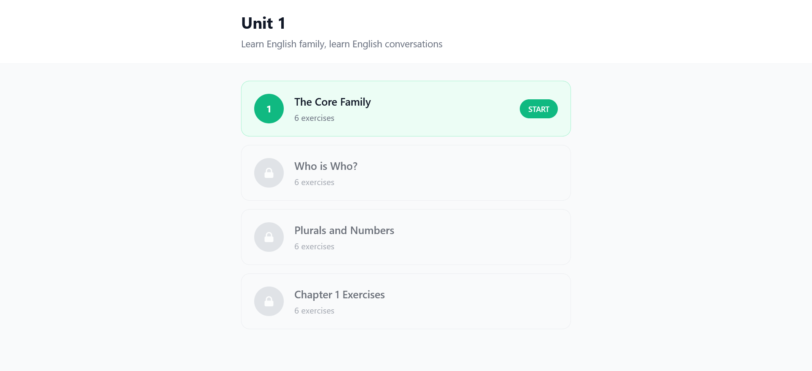

---

### Learning Card — Story Type

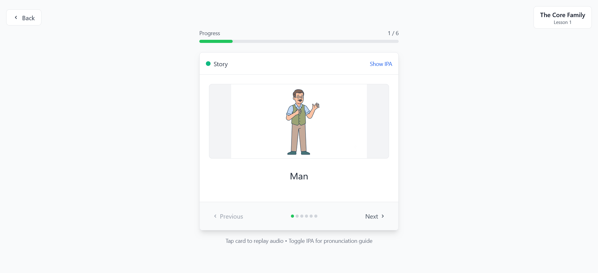

---

### Learning Card — IPA Pronunciation

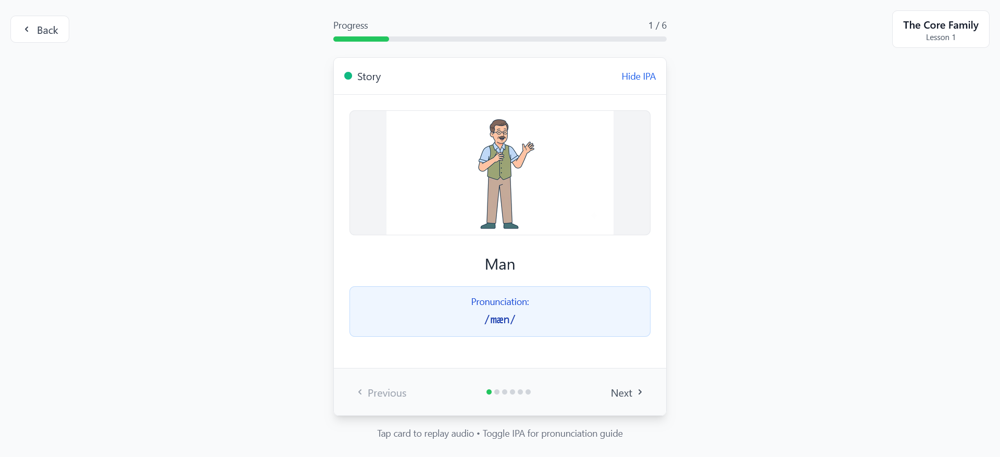

</details>

---

<details>
  <summary><h2>Backlog</h2></summary>

🔗 [Product Backlog (Miro)](https://miro.com/app/board/uXjVHD7M_YM=/?share_link_id=120371824479)

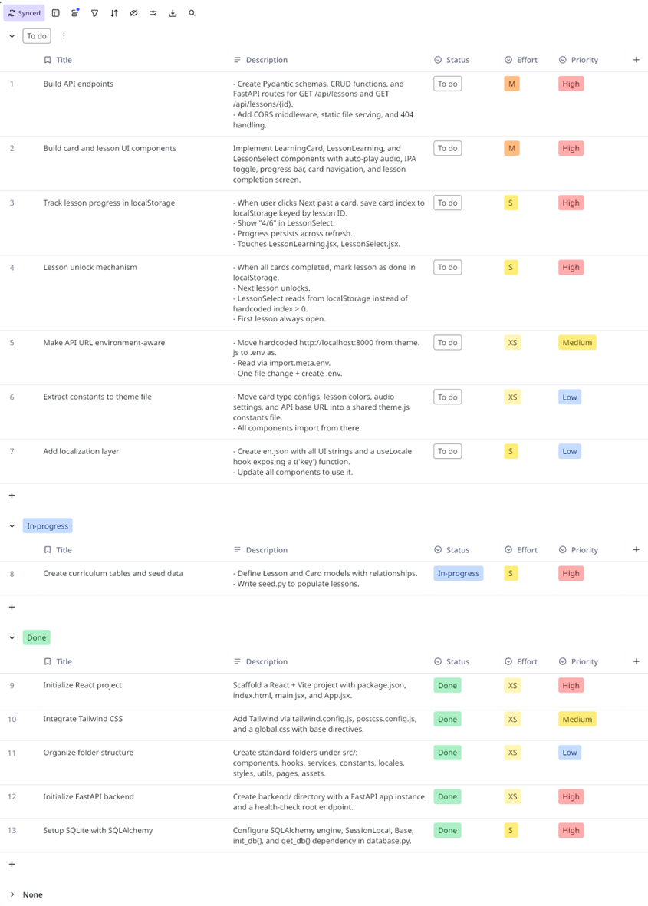

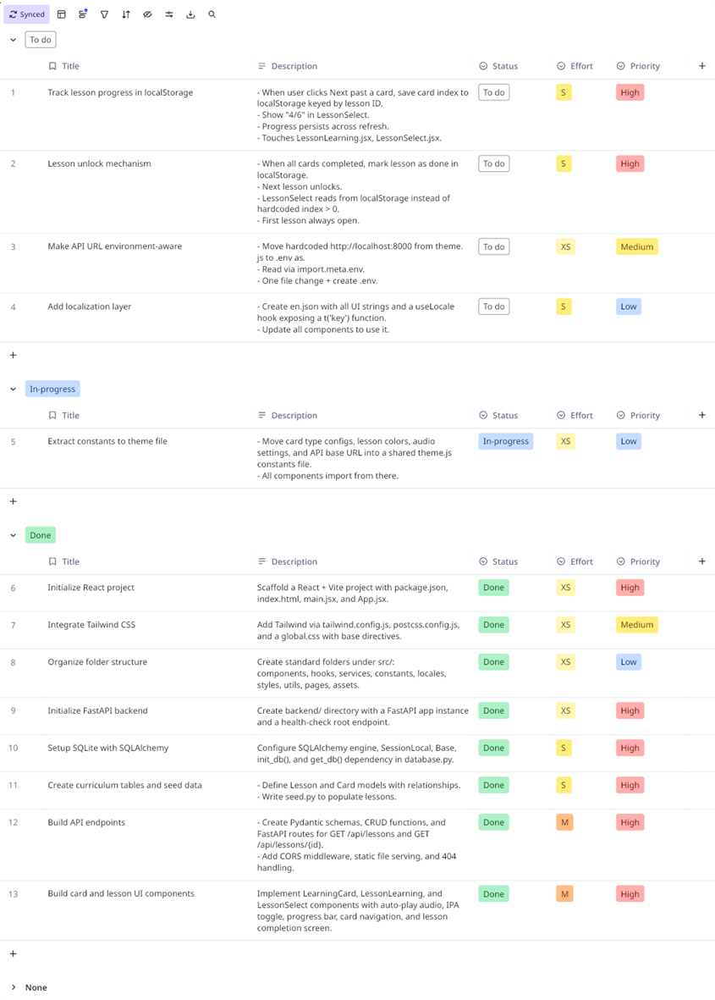

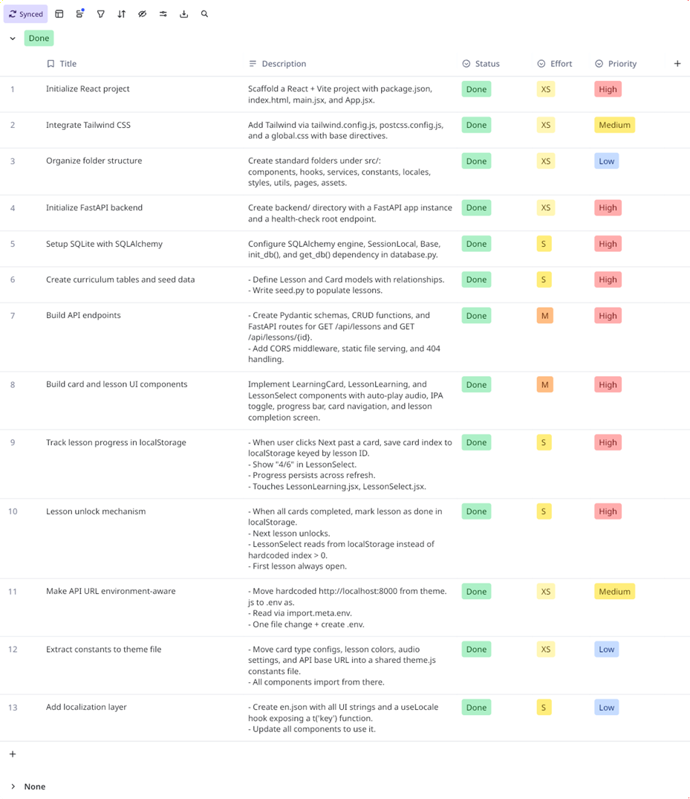

</details>

---

<details>
  <summary><h2>Burndown Chart</h2></summary>

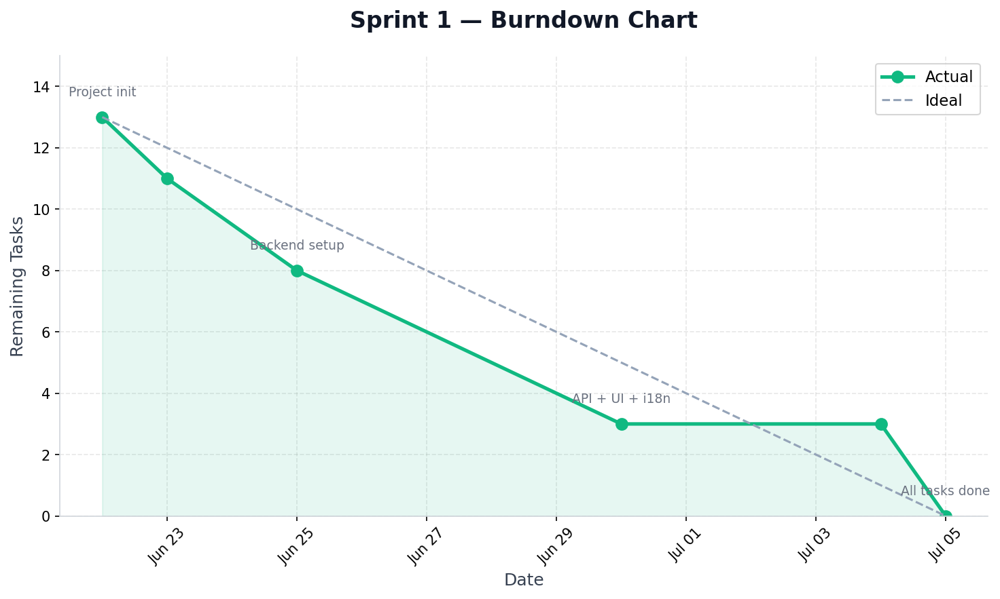

</details>

---

<details>
  <summary><h2>Database Schema</h2></summary>

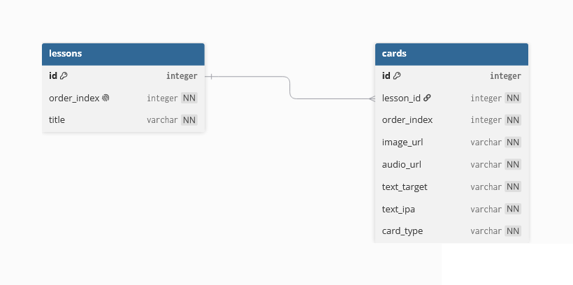

**Tables:**

```
lessons
├── id (PK, Integer)
├── order_index (Integer, unique)
└── title (String)

cards
├── id (PK, Integer)
├── lesson_id (FK → lessons.id, CASCADE)
├── order_index (Integer)
├── image_url (String)
├── audio_url (String)
├── text_target (String)
├── text_ipa (String)
└── card_type (String: STORY | FILL_BLANK | SPEECH)
```

</details>

---

- **Sprint Notes:**
  * It was decided to use _`Tailwind CSS`_ for styling with a minimalist design approach.
  * It was decided to use _`Miro`_ as the project management tool.
  * AI-assisted pair programming was used throughout the sprint via _`Kiro`_.
  * It was decided that the pedagogical approach would be strictly _`Natural Approach`_ — no grammar, no translations.
  * It was decided that _`IPA transcriptions`_ would be included on every card for pronunciation guidance.
  * It was decided to use _`SQLite`_ for local-first data serving to minimize API costs.
  * It was decided that all UI strings would be in **target language** with localization support ready via JSON.

- **Expected point completion within Sprint:**
  * `13` tasks

- **Point Completion Logic:**
  * A total of 3 sprints are planned. Sprint 1 focused on architectural foundation and the core learning flow prototype. Sprint 2 will focus on interactivity and content expansion. Sprint 3 will handle deployment and polish.

- **Sprint Review:**
  * The full-stack architecture was established: React frontend consuming FastAPI backend with SQLite.
  * The core learning flow is functional end-to-end: select lesson → view cards → hear audio → see IPA (opt.) → navigate → complete.
  * Multiple UI iterations were done and there will be (only) one more, i hope.
  * Constants and localization layers were extracted for maintainability.
  * TTS-generated audio files provide working audio playback on all cards.
  * The seed script provides reproducible demo data with accurate IPA transcriptions.

- **Sprint Review Participants:**
  * `İbrahim :D`

- **Sprint Retrospective:**
  * It was decided to research and integrate AI-powered adaptive learning for Sprint 2 and 3.
  * It was decided to expand contents for more structured learning experience.
  * It was decided to implement interactive fill-the-blank input as core interactivity.
  * It was decided to postpone Speech API integration to Sprint 3 due to complexity and browser dependency.
  * It was decided to define visual style guide BEFORE coding UI in future sprints to avoid multiple redesign iterations.
  * It was decided to commit more frequently — one commit per completed task instead of batching.

---

**Lessons Learned:**

| Issue | Root Cause | Action for Sprint 2 |
|-------|-----------|---------------------|
| Placeholder images overwrote existing real assets | AI ran generation script without checking existing files | Always verify existing assets before generating |
| Seed URLs inconsistency (first card full URL, rest relative) | Partial manual edit | Use batch regex replacement |
| 3 UI redesign iterations | No visual direction defined upfront | Define style guide before coding |

---

**Git History:**

| Commit | Date | Message |
|--------|------|---------|
| `86964dd` | Jun 22 | first commit |
| `5659db9` | Jun 23 | integrate tailwindcss |
| `a7ee515` | Jun 23 | folder structure |
| `30fb7f7` | Jun 25 | fastapi |
| `ccc7c12` | Jun 25 | feat: setup SQLite database and SQLAlchemy models |
| `8f43e0f` | Jun 30 | feat: add API layer, seed data, and minimalist lesson/card UI with auto-play audio |
| `a09d3ca` | Jun 30 | add constants and locales |
| `df908ac` | Jul 04 | revise theme and lesson select screen |
| `936f23c` | Jul 05 | update README for first sprint |
| `997f549` | Jul 05 | track lesson progress in localStorage |
| `04938df` | Jul 05 | add lesson unlock mechanism |

</details>

---

<details>
  <summary><h1>Sprint 2</h1></summary>

---

<details>
  <summary><h2>App Screenshots</h2></summary>

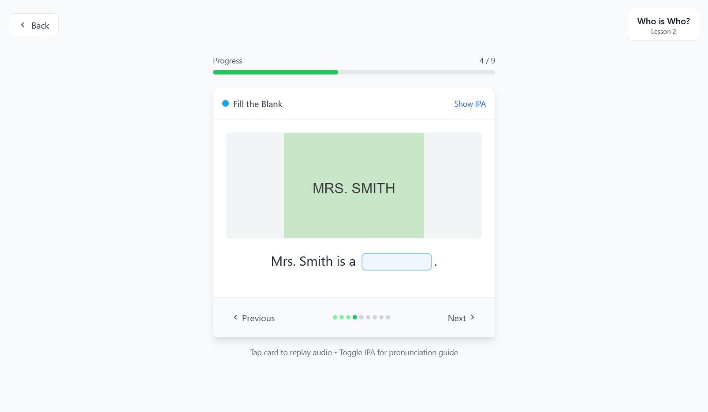

---

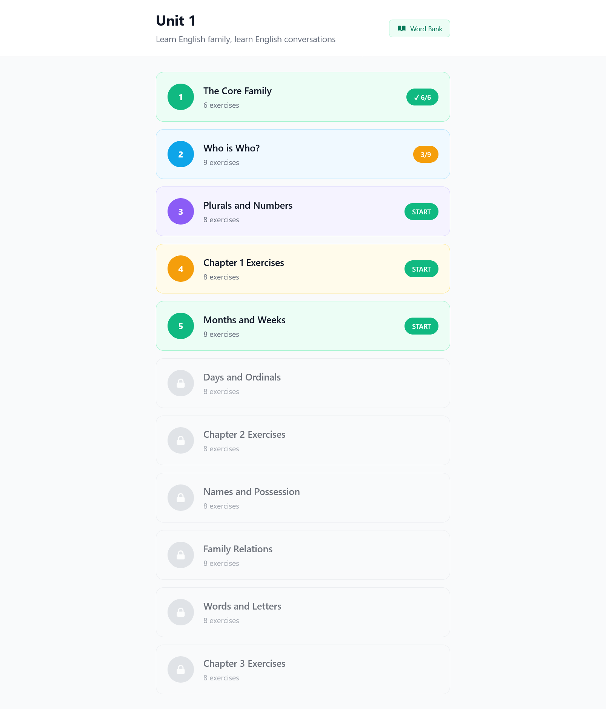

---

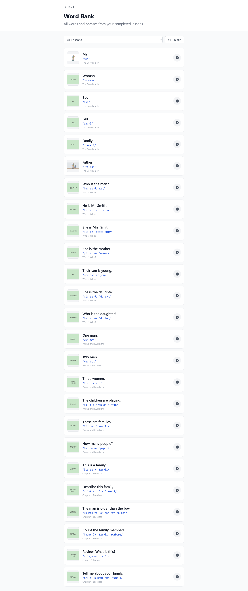

</details>

---

<details>
  <summary><h2>Backlog</h2></summary>

🔗 [Product Backlog (Miro)](https://miro.com/app/board/uXjVHD7M_YM=/?share_link_id=120371824479)

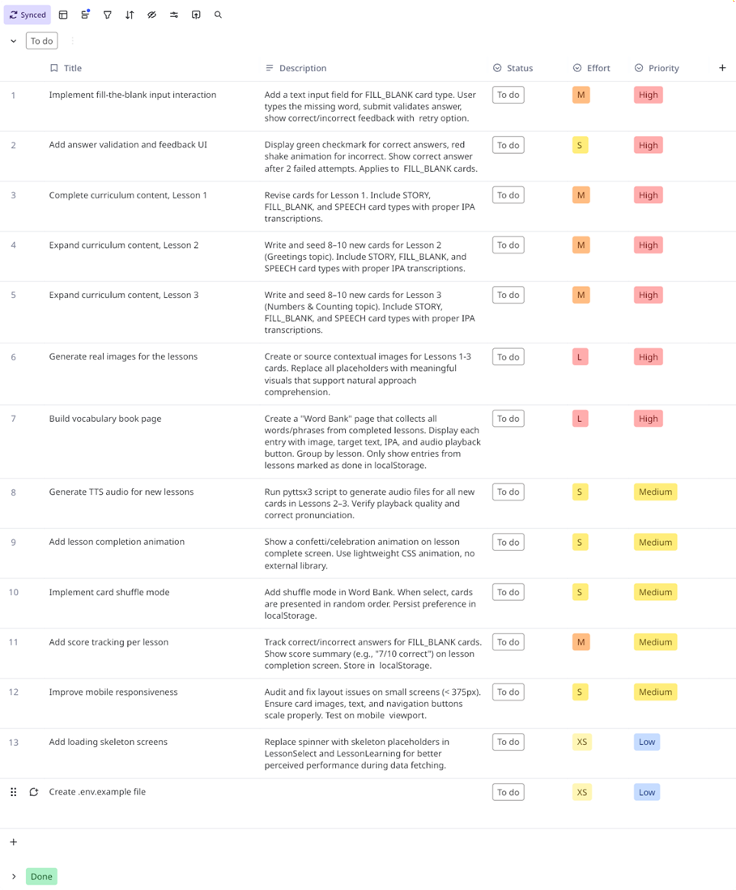

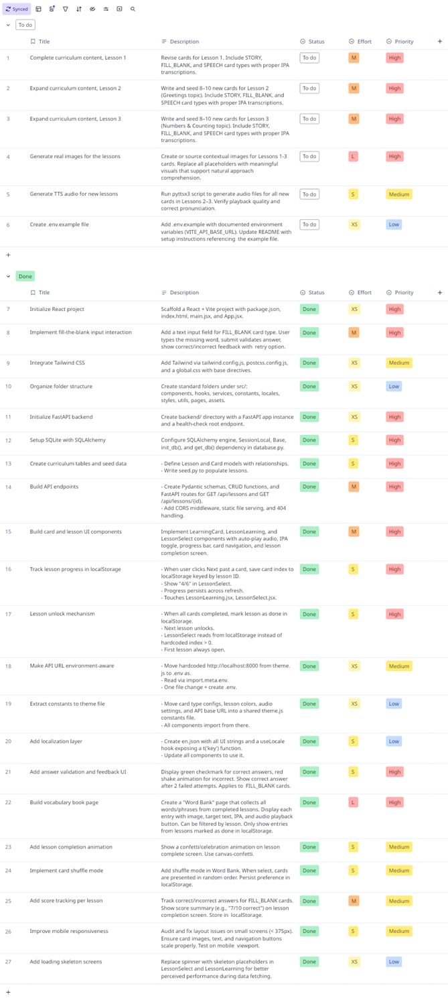

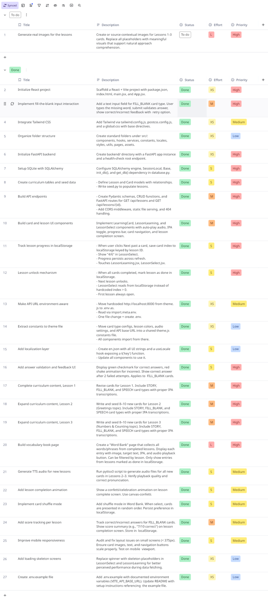

</details>

---

<details>
  <summary><h2>Burndown Chart</h2></summary>

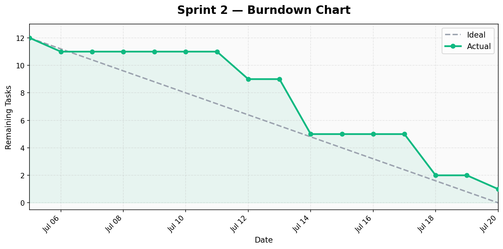

</details>

---

<details>
  <summary><h2>Database Schema</h2></summary>

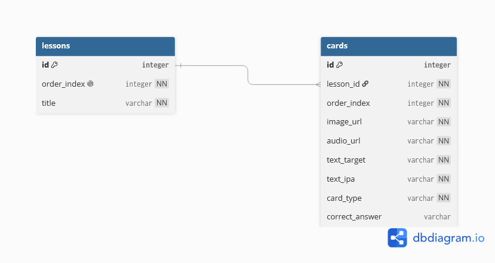

**Tables (updated in Sprint 2):**

```
lessons
├── id (PK, Integer)
├── order_index (Integer, unique)
└── title (String)

cards
├── id (PK, Integer)
├── lesson_id (FK → lessons.id, CASCADE)
├── order_index (Integer)
├── image_url (String)
├── audio_url (String)
├── text_target (String)
├── text_ipa (String)
├── card_type (String: STORY | FILL_BLANK | SPEECH)
└── correct_answer (String, nullable) ← NEW: used for FILL_BLANK validation
```

</details>

---

- **Sprint Notes:**
  * It was decided to implement `FILL_BLANK` as the primary interactive card type with retry-based feedback.
  * It was decided to use `localStorage` for all user state (progress, scores, completion, shuffle preference) — no backend auth required.
  * It was decided to add a `WordBank` vocabulary reference page for spaced repetition review.
  * It was decided to add `canvas-confetti` for lesson completion celebration feedback.
  * It was decided to expand curriculum from 1 chapter (4 lessons) to 3 chapters (11 lessons).
  * It was decided to implement sequential lesson unlock — lesson N must be completed before N+1 is accessible.
  * It was decided to defer full Speech API integration to Sprint 3 (SPEECH card type added but recognition not wired).
  * AI-assisted pair programming continued via _`Kiro`_.

- **Expected point completion within Sprint:**
  * `12` tasks

- **Point Completion Logic:**
  * Sprint 2 focused on interactivity, content expansion, and gamification elements. The core fill-blank exercise flow, vocabulary bank, score tracking, and mobile responsiveness were delivered. Speech recognition was stubbed but deferred.

- **Sprint Review:**
  * Fill-the-blank interactive input is functional: template parsing, input validation, shake animation on error, answer reveal after 2 failed attempts.
  * WordBank vocabulary page aggregates all learned words with filtering, shuffle mode, and per-word audio playback.
  * Score tracking per lesson with correct/incorrect counters and localStorage persistence.
  * Confetti animation fires on lesson completion for positive reinforcement.
  * Curriculum expanded to 11 lessons across 3 chapters with 57 new audio files and corresponding images.
  * Mobile responsiveness improved across all components with `sm:` breakpoint utilities.
  * Loading skeleton screens added for better perceived performance.
  * Environment-aware API URL via `.env` configuration.

- **Sprint Review Participants:**
  * `İbrahim :D`

- **Sprint Retrospective:**
  * It was decided to implement Speech Recognition API in Sprint 3 for the SPEECH card type.
  * It was decided to explore deployment options (Vercel + Railway or similar) in Sprint 3.
  * It was decided to add user authentication if multi-device sync is needed in future.
  * It was decided that the current localStorage approach works well for MVP but has no cross-device capability.
  * It was decided to add more visual feedback and animations to keep learners engaged.
  * Commit frequency improved compared to Sprint 1 — smaller, more atomic commits.

---

**Lessons Learned:**

| Issue | Root Cause | Action for Sprint 3 |
|-------|-----------|---------------------|
| Fill-blank validation edge cases (casing, whitespace) | Initial strict comparison | Normalized with `.trim().toLowerCase()` |
| Audio autoplay blocked on mobile | Browser policy requires user interaction | Skip auto-play for SPEECH type, manual play fallback |
| localStorage growing with progress data | No cleanup mechanism | Consider periodic cleanup or size limit |
| Shuffle state resets on page reload despite persistence | Fisher-Yates generates new order each mount | Stored shuffle preference, re-shuffle on toggle only |

---

**Git History:**

| Commit | Date | Message |
|--------|------|---------|
| `21c7739` | Jul 05 | make API URL environment aware |
| `88a4fc7` | Jul 12 | revise readme and add backlog for sprint_2 |
| `c5b8fd0` | Jul 12 | implement fill-the-blank interactive input with answer validation |
| `e2b1c75` | Jul 14 | add fill-blank interaction with validation feedback and fix curriculum order |
| `bb1b557` | Jul 14 | build vocabulary book page |
| `37142ff` | Jul 14 | implement card shuffle mode |
| `b4d9931` | Jul 14 | add confetti as lesson completion animation |
| `16b194d` | Jul 18 | add score tracking per lesson |
| `4207088` | Jul 18 | improve mobile responsiveness |
| `2234db0` | Jul 18 | add loading skeleton screens |
| `f1f66c2` | Jul 20 | complete curriculum content: lesson 1, 2, and 3 |
| `6f9cf41` | Jul 20 | add new audios |

</details>

---

<details>
  <summary><h2>Folder Structure</h2></summary>

```
glonie/
├── backend/
│   ├── assets/
│   │   ├── images/          # Card images (placeholder + real)
│   │   └── audio/           # TTS-generated audio files (57 files)
│   ├── database.py          # SQLAlchemy models + engine
│   ├── schemas.py           # Pydantic serialization schemas
│   ├── crud.py              # Database query functions
│   ├── main.py              # FastAPI app, routes, CORS, static files
│   ├── seed.py              # Database seeding script (3 chapters, 11 lessons)
│   └── glonie.db            # SQLite database file
├── src/
│   ├── components/
│   │   ├── LessonSelect.jsx   # Lesson list with lock/unlock states
│   │   ├── LessonLearning.jsx # Lesson flow manager + score tracking
│   │   ├── LearningCard.jsx   # Card display + audio + IPA + fill-blank
│   │   └── WordBank.jsx       # Vocabulary reference page with filter/shuffle
│   ├── constants/
│   │   └── theme.js         # CARD_TYPES, LESSON_COLORS, AUDIO
│   ├── locales/
│   │   └── en.json          # All UI strings
│   ├── hooks/
│   │   ├── useLocale.js     # t('key') translation hook
│   │   └── useLessons.js    # Data fetching hooks
│   ├── services/
│   │   └── api.js           # API client (getLessons, getLesson)
│   ├── styles/
│   │   └── global.css       # Tailwind directives
│   ├── App.jsx              # Root component, view routing
│   └── main.jsx             # React entry point
├── .env                     # Environment variables (VITE_API_BASE_URL)
├── package.json
├── vite.config.js
├── tailwind.config.js
├── postcss.config.js
└── eslint.config.js
```

</details>

---
